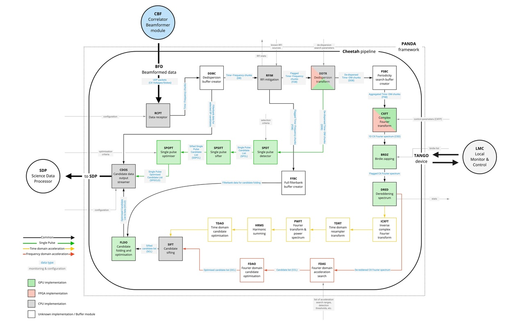

\anchor Main
\mainpage Introduction

This document describes the Cheetah project and its API (Application Programming Interface).

\section main_whatis What is Cheetah?

Cheetah is a C++ library and a set of computational pipelines for processing beamformed data from radio telescopes.
It has been developed for the [SKA][SKA] non imaging pipeline and is based on
the [PANDA C++ pipeline utility library][panda_git]. Although predominantly designed for the
SKA it is able to support other telescopes and is currently running as part of the [MeerTRAP](http:meertrap.org) project on [MeerKAT](https://www.sarao.ac.za/) .

Cheetah is desinged to support:
- multi-threading
- multiple heterogeneous hardware acceleration devices
- automatic load balancing
- detection and automated adaptation for supported hardware accelerators
- user configurable allocation of compute resource to specific parts of the processing pipeline
- interchangeability of processing algorithms (e.g. for prototyping, or to support new hardware accelerators)

### Cheetah for the SKA

A detailed description of the SKA implementation is beyond the scope of this document, but those who are interested
and have access can refer to the [SKA Solution Intent](https://confluence.skatelescope.org/pages/viewpage.action?spaceKey=SWSI&title=PSS+Architecture). A summary
of the different modules that are being developed can be seen below in this Component and Connecter(CnC) view.

## Cheetah Pipelines - A brief overview
Each cheetah pipeline is composed of an asyncronous chain of data processing modules.

The pipeline will retrieve data from a data source such as
a UDP packet stream, or a filterbank file
(you specify this source on the command line or in a configuration file).
The pipeline will then pass this data to the first module in the processing chain. The module will obtain a suitable resource to execute the processing (e.g. a CPU thread, or a GPU accelerator) and once complete will pass the results on to the next processing stage which will in turn call the next module until the processing is complete.

For more information on pipelines and how they work, please see the panda documentation.

### Cheetah Modules
Each module corresponds to a specific data processing task and has well defined input and output interfaces to define
the data it can process and the type of results it produces.

Most, but not all, cheetah modules are designed to support multiple
algorithms that perform the processing task assigned to the module.
For example, the FFT module performs a fast Fourier transform and
has an algorithm that works on an FPGA, and another that uses
a CUDA based GPU accelerator.
As well as utilising accelerators, you may also want to select
different algorithms for different initial conditions, or for comparing/benchmarking alternative techniques.

# Getting Started:

- @subpage download "Obtaining a copy of Cheetah"
- @subpage build "Building Cheetah"
- @subpage run-pipeline "Running a Cheetah pipeline"
- @subpage apps "Other Cheetah Applications"
- @subpage for_cpp_developers "Cheetah for C++ developers"

@defgroup core Cheetah modules
@defgroup test_utils Cheetah Test utility modules
@defgroup architecture Cheetah Architecture Descriptions
@defgroup apps Applications
@defgroup getting_started Getting Started

[panda]: https://ska-telescope.gitlab.io/pss/ska-pss-panda/ "Panda C++ data processing pipeline framework"
[panda_git]: https://gitlab.com/ska-telescope/pss/ska-pss-panda "Panda Gitlab Repository"
[SKA]: https://www.skao.int/ "SKA Main Page"
